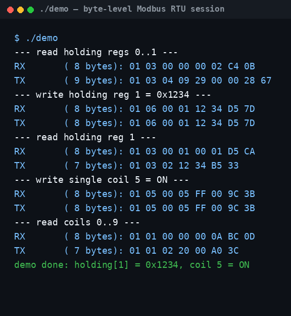

# modbus-rtu-slave

[](LICENSE) [](src/)

Modbus RTU slave stack in C. No malloc, no libc I/O in the stack itself —
I wrote it to learn the protocol properly. It parses frames, checks the
CRC-16, handles register and coil reads/writes, and answers with the right
exception when the master asks for something it shouldn't.

Supports 0x01/0x03/0x04 (reads), 0x05/0x06 (single writes), 0x0F/0x10
(block writes). Bad CRC or wrong address gets silence; broadcast writes
apply without a reply. That's what the spec says to do, so that's what it
does.

There's also a set of master-side request builders (`src/modbus_master.*`)
for whipping up valid frames in tests or integration code, and a fake UART
(`hal/mock_uart.*`) so the whole thing runs and tests on a normal PC —
no hardware needed.

## What's in here

- **Function codes:** 0x01 read coils, 0x03/0x04 read registers,
  0x05/0x06 write single coil/register, 0x0F/0x10 write multiple
- **Coils** bit-packed LSB-first, same range/exception discipline as registers
- **Exceptions** 0x01 (bad function), 0x02 (bad address), 0x03 (bad value)
- **RTU framing** via line silence (`modbus_rx_t`) with an injectable ms
  clock — no hardware timers needed for tests
- **UART abstraction** (`hal_uart_t`) so the same code runs on target and host

## Layout

```
hal/        UART abstraction + fake UART (scripted RX, captured TX, fake clock)
src/        the stack: modbus_rtu.* (slave), modbus_master.* (request builders)
app/        demo: slave on the fake UART, scripted master session
tests/      self-contained suite, 30 tests, no external framework
```

## Build & test

```sh
make test     # builds and runs the 30-test suite
make demo && ./demo
```

Compiles clean under `gcc -Wall -Wextra -Werror -std=c11 -pedantic`.

## Demo output

```
--- read holding regs 0..1 ---
RX       ( 8 bytes): 01 03 00 00 00 02 C4 0B
TX       ( 9 bytes): 01 03 04 09 29 00 00 28 67
--- write holding reg 1 = 0x1234 ---
RX       ( 8 bytes): 01 06 00 01 12 34 D5 7D
TX       ( 8 bytes): 01 06 00 01 12 34 D5 7D
--- read holding reg 1 ---
RX       ( 8 bytes): 01 03 00 01 00 01 D5 CA
TX       ( 7 bytes): 01 03 02 12 34 B5 33
--- write single coil 5 = ON ---
RX       ( 8 bytes): 01 05 00 05 FF 00 9C 3B
TX       ( 8 bytes): 01 05 00 05 FF 00 9C 3B
--- read coils 0..9 ---
RX       ( 8 bytes): 01 01 00 00 00 0A BC 0D
TX       ( 7 bytes): 01 01 02 20 00 A0 3C
```

## Screenshots

The demo session as it actually runs — slave on the fake UART answering a
scripted byte-level master, same output as the transcript above.



## Porting to real hardware

1. Implement `hal_uart_t` against your UART (blocking read with timeout,
   write, and a ms tick — SysTick or a timer).
2. Use the 3.5-char silence for your baud rate as `frame_gap_ms`
   (~4 ms at 9600, ~2 ms at 19200 — both assume 11-bit char framing:
   3.5 chars x 11 bits / baud).
3. Point `modbus_map_t` at your real registers/coils and call
   `modbus_process_frame()` on each delimited frame.
